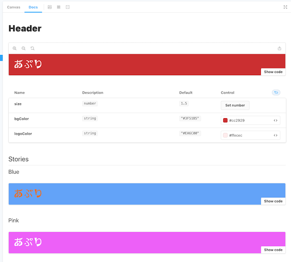

# Diet record App

```bash
npx create-next-app --ts App
yarn dev
yarn build
yarn lint
```

## Install Tailwind CSS with Next.js

```bash
yarn add -D tailwindcss postcss autoprefixer
npx tailwindcss init -p
```

`npx tailwindcss init -p`でファイルが形成されたら設定を書き込む。

## storybook の導入

```bash
npx sb init --builder webpack5
yarn add util
yarn add typescript@"<4.8"
```

エラーの関係で typescript のバージョンは上のように指定。[^1]

`yarn sb`で起動を確認

`main.js`と`preview.js`の両方設定を忘れずに(sb で tailwind が効かなくなる)

▼ storybook を使うとコンポーネント単位でデザインの変更を気軽に試せて便利


### addon の追加

便利そうだなと思ったのをいくつか導入します

```bash
yarn add -D @storybook/addon-docs @storybook/addons @storybook/theming

//Storybook Support for Tailwind
yarn add -D @storybook/addon-postcss
```

Docs has peer dependencies on react and babel-loader. If you want to write stories in `MDX`, you'll need to add these dependencies as well:

```bash
yarn add -D react babel-loader
```

## Prettier

- コードの整形

```bash
yarn add --dev --exact prettier
echo {}> .prettierrc.json

//format all files with Prettier:
yarn prettier --write .
```

## ESLint

- 構文チェック

```bash
yarn add -D eslint-plugin-storybook @typescript-eslint/eslint-plugin @typescript-eslint/eslint-plugin eslint-plugin-import eslint-plugin-react-hooks
```

## git hooks 使用

```bash
yarn add -D husky
npx husky install
```

`.huskyrc`フォルダが作成されたら以下のコマンドで書き込む:

```bash
npx husky add .husky/pre-commit "yarn lint"
npx husky add .husky/pre-push "yarn build"
```

`commitlint.config.js`ファイルを作る

```bash
yarn add -D @commitlint/config-conventional @commitlint/cli
npx husky add .husky/commit-msg 'npx --no -- commitlint --edit "$1"'
```

## SVG ファイルを React コンポーネントとして import できるようになります

```bash
yarn add -D @svgr/webpack
```

参考にさせていただいたリンク:</br>
[Next.js における SVG ファイルの表示方法を考える](https://zenn.dev/toono_f/articles/bd50ddd0a7bc76)

※ 試そうと思いましたが storybook 側で反映させるのに別設定が必要っぽいのでひとまず保留

## その他使用する便利なライブラリ

```bash
yarn add classnames axios sass
```

[^1]: https://stackoverflow.com/questions/73507563/deprecationwarning-getmutableclone-has-been-deprecated-since-v4-0-0-use-an-a
